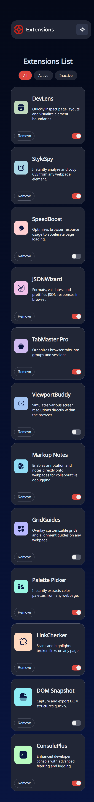
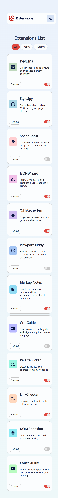

# Frontend Mentor - Browser extensions manager UI solution

This is a solution to the [Browser extensions manager UI challenge on Frontend Mentor](https://www.frontendmentor.io/challenges/browser-extension-manager-ui-yNZnOfsMAp). Frontend Mentor challenges help you improve your coding skills by building realistic projects.

## Table of contents

- [Overview](#overview)
  - [The challenge](#the-challenge)
  - [Screenshot](#screenshot)
  - [Links](#links)
- [My process](#my-process)
  - [Built with](#built-with)
  - [What I learned](#what-i-learned)
  - [Continued development](#continued-development)
  - [Useful resources](#useful-resources)
- [Author](#author)
- [Acknowledgments](#acknowledgments)

## Overview

### The challenge

Users should be able to:

- Toggle extensions between active and inactive states
- Filter active and inactive extensions (not added yet)
- Remove extensions from the list (not added yet)
- Select their color theme
- View the optimal layout for the interface depending on their device's screen size
- See hover and focus states for all interactive elements on the page

### Screenshot




### Links

- Solution URL: [Add solution URL here](https://github.com/c0rnY6uy222/browser-extensions)
- Live Site URL: [Add live site URL here](https://your-live-site-url.com)

## My process

After long pause in programming world, this project really was a challenge for me and I'm really proud that I was able to do certain parts of app.
This was my second try (not complete yet) because my first try was accidentally erased. Project like this will probably be a kickstart for my future job.

I wanted to showcase line of code that I'm most proud of. It's not much but I feel like this is one line from which I started understanding react much better than before.

### Built with

- CSS
- Flexbox
- Mobile-first workflow
- [React](https://reactjs.org/) - JS library

### What I learned

```js
const [data, setData] = useState([]);

  useEffect(() => {
    axios
      .get("/src/data.json")
      .then((response) => {
        setData(response.data);
      })
      .catch((error) => alert(error));
  }, []);

  return (
    <main className="cards">
      <Filters />

      {data.map((card, key) => (
        <Card
          key={key}
          logo={card.logo}
          name={card.name}
          description={card.description}
          num={key}
          isActive={card.isActive}
        />
      ))}
    </main>
```

### Continued development

While writing this code I saw that I'm not understanding props properly and how they function.
The biggest problem I encountered was filtering for active and inactive extensions and, unfortunatelly, I wasn't able to complete that task. But I hope that I'll come again to this project when I get better and add it.

### Useful resources

- [Stack Overflow](https://stackoverflow.com/questions) - Forum overflowing with experienced developers ready to help with any problem.
- [W3Schools](https://www.w3schools.com/) - Good for learning basic HTML, CSS and JS concepts

## Author

- Frontend Mentor - [@c0rnY6uy222](https://www.frontendmentor.io/profile/c0rnY6uy222)

## Acknowledgments

For my last word I wanted to thank experienced community from Stack Overflow who managed to help people in tasks, including me.
